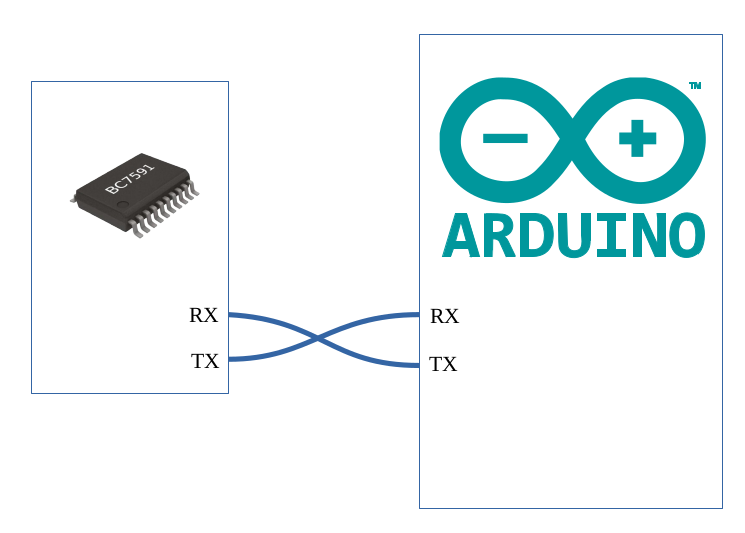

# UART Keyboard Library For Arduino

---

## Overview

BC6xxx and BC759x series chips share a unified single line UART keyboard interface. This library can be used for the following chips:

- BC6301 -- 30-key key matrix interface

- BC6040 -- 40-key key matrix interface

- BC6561 -- 56-key key matrix interface

- BC6088 -- 88-key key matrix interface

- BC7595 -- 6 digits 7-segment LED display with 48-key key matrix driver

- BC7591 -- 32 digits 7-segment LED display with 96-key key matrix driver

This library is available for all Arduino devices, and can be used for both hardware and software serial ports.
By using this library, in addition to easily handling common single-key events, complex keyboard functions such as key combinations and long-press keys can be implemented with just a few lines of code.
In the UART single line keyboard interface, a keyboard event is represented by a single byte each time. Value 0-0x7F represents the key number value, the highest bit is used as a key release flag, that is, value 0-0x7F means the key is pressed, 0x80-0xFF means the key is released, so theoretically the maximum number of keys is 128. In reality the BC7591 can support up to 96 keys. This library uses the unused key number space to allow users to assign combination keys and long-press keys a custom key number, so that in the user program, handling of combination keys and long-press keys is as simple as the handling of ordinary keys, everything else is handled by the library.
The library is very simple to use, requiring only 3 steps.

1. In loop(), call the checkChanges() function.

2. query isKeyChanged()

3. If the result of isKeyChanged() is true, use getKeyValue() to get the key value

For detailed information about the UART keyboard interface, please refer to the datasheet of the BC6xxx or BC759x series chips.

## Library Installation

This library is available in Arduino Library Manager, can be also installed using the zip file downloaded, just goto "Sketch-->Include Library-->Add .ZIP Libaray..."

## Hardware Connection

The BC6xxx and BC759x series chips both use UART serial communication, and the UART uses 2 pins TX and RX on the chip, where TX is the output of the chip's keyboard interface. The BC6xxx chip does not have RX pins, they are only available on the BC759x, which is used for the LED driver. When connected, the TX/RX pins of the chip are cross-connected with the RX/TX pins of the Arduino serial port.

More detailed information about this library please see : [usage](./extras/docs/usage.md)

Or for the PDF version of complete user manual in [简体中文](./extras/docs/BC6xxx_BC759x_UART_Keyboard_Arduino_Library_cn.pdf) or [English](./extras/docs/BC6xxx_BC759x_UART_Keyboard_Arduino_Library.pdf)
